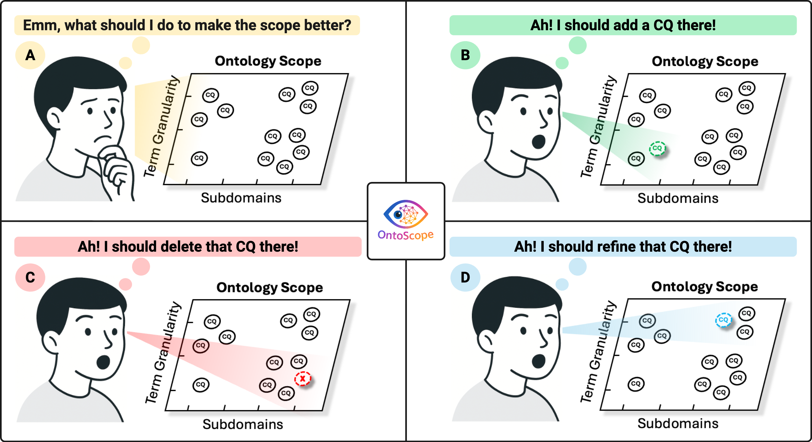

# OntoScope: Using a Divergent-Convergent Interaction Framework to Support LLM-based Ontology Scoping

## Introduction



A conceptual overview of the ontology scoping process supported by OntoScope. It presents a two-dimensional space defined by different subdomains (horizontal axis) and term granularities (vertical axis), representing the overall ontology scope. Each intersection in this space corresponds to a conceptual area that combines a subdomain and a level of detail, where competency questions (CQs) can be positioned and evaluated. CQs serve as functional requirements of an ontology and suggest possible terminologies (e.g., concepts and relationships) that help define the scope of knowledge to be modelled.

At the beginning of the scoping process, the Large Language Model (LLM) initializes values along these two axes and generates CQs with their suggested terms distributed across the space. Ontology engineers then enter an iterative workflow:

- **(A)** Realizing gaps or overlaps that require further attention by forming an all-encompassing view of the target scope
- **(B)** Engaging in **divergent thinking** by making informed decisions on adding new CQs in specific intersections through exploring under-represented areas, where the LLM assists by suggesting new CQs corresponding to those intersections, helping engineers recognize that certain subdomains or levels lack sufficient representation
- **(C)** Engaging in **convergent thinking** by deciding to delete redundant or irrelevant CQs after comparing those within or across intersections and realizing overlaps or misalignments in the current scope, where the LLM learns from such deletions to avoid generating similar CQs in future iterations
- **(D)** Continuing the process of **convergent thinking** by refining the terminologies suggested by specific CQ to improve their precision, where the LLM supports by suggesting alternative terms or rephrasings, helping engineers identify and resolve ambiguities that limit conceptual clarity

By engaging in this iterative process, ontology engineers can systematically explore, expand, and refine the scope of their ontology.

## Installation

### Prerequisites

- Node.js 20.x or higher
- npm (comes with Node.js)
- An OpenAI API key

### Steps

1. **Clone the repository**
   ```bash
   git clone <repository-url>
   cd ontoscope
   ```

2. **Install dependencies**
   ```bash
   npm install
   ```

3. **Start the application**
   ```bash
   npm run dev
   ```

4. **Access the application**
   
   Open your browser and navigate to `http://localhost:5000`

5. **Enter your OpenAI API key**
   
   When prompted, enter your OpenAI API key to enable AI-powered CQ generation.

### Usage

1. Enter a target domain (e.g., "University Administration", "Healthcare Informatics")
2. Click "Generate Space" to initialize the CQ space with AI-generated subdomains and granularity levels
3. Click on any intersection to explore and add competency questions
4. Use the visualization to identify gaps, delete redundant CQs, and refine terminology
5. Export your finalized CQ space as JSON for use in ontology development tools
